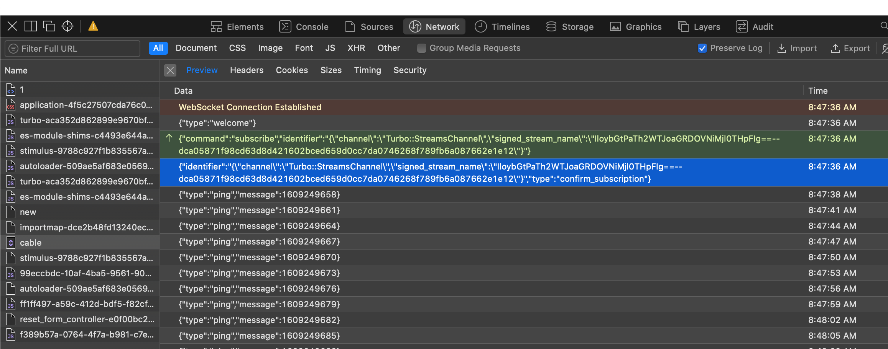

# Debugging Web Socket Notes

## Problem #1: Javascript reports unsupported protocol

##  Solution #1: Set subprotocol to `actioncable-v1-json` on Java handler 

Per
https://medium.com/swlh/websockets-with-spring-part-1-http-and-websocket-36c69df1c2ee, 
make CableHandler `implement SubProtocolCapable`:

```
  @Override
  public List<String> getSubProtocols() {
    return Collections.singletonList("actioncable-v1-json");
  }
```

### Uncommented enable logger.

Hack.

```
var logger = {
  log(...messages) {
//    if (this.enabled) {
      messages.push(Date.now());
      adapters.logger.log("[ActionCable]", ...messages);
//    }
  }
};
```

(I also added in some `console.log("MKB: ...")` statements.)


### Java trace log shows WebSocket upgrade sets subProtocol to null

To debug Java side, add a variable to jar command line 

    -Dlogging.level.org.springframework.web.socket=TRACE 

Output:

```
2020-12-31 14:23:52.610 TRACE 3076 --- [nio-8080-exec-5] o.s.w.s.s.s.WebSocketHandlerMapping      : Mapped to HandlerExecutionChain with [org.springframework.web.socket.server.support.WebSocketHttpRequestHandler@16612a51] and 1 interceptors
2020-12-31 14:23:52.622 DEBUG 3076 --- [nio-8080-exec-5] o.s.w.s.s.s.WebSocketHttpRequestHandler  : GET /cable
2020-12-31 14:23:52.633 TRACE 3076 --- [nio-8080-exec-5] o.s.w.s.s.s.DefaultHandshakeHandler      : Processing request http://localhost:8080/cable with headers=[upgrade:"websocket", connection:"Upgrade", host:"localhost:8080", origin:"http://localhost:8080", sec-websocket-protocol:"actioncable-v1-json, actioncable-unsupported", pragma:"no-cache", cache-control:"no-cache", sec-websocket-key:"mDqYOtAxukGoOu1/Sewqtw==", sec-websocket-version:"13", sec-websocket-extensions:"x-webkit-deflate-frame", user-agent:"Mozilla/5.0 (Macintosh; Intel Mac OS X 10_15_7) AppleWebKit/605.1.15 (KHTML, like Gecko) Version/14.0.1 Safari/605.1.15", cookie:"Idea-df58c19a=1081a546-8835-4eb5-a706-bef371d4e4dc"]
2020-12-31 14:23:52.639 TRACE 3076 --- [nio-8080-exec-5] o.s.w.s.s.s.DefaultHandshakeHandler      : Upgrading to WebSocket, subProtocol=null, extensions=[]
2020-12-31 14:23:52.884 DEBUG 3076 --- [nio-8080-exec-5] s.w.s.h.LoggingWebSocketHandlerDecorator : New StandardWebSocketSession[id=6c3eb31c-ab7c-eb4d-2437-f33ae7a05ee4, uri=ws://localhost:8080/cable]
2020-12-31 14:23:52.897 DEBUG 3076 --- [nio-8080-exec-5] s.w.s.h.LoggingWebSocketHandlerDecorator : StandardWebSocketSession[id=6c3eb31c-ab7c-eb4d-2437-f33ae7a05ee4, uri=ws://localhost:8080/cable] closed with CloseStatus[code=1000, reason=null]
```


## Problem #2 [ActionCable] – "ConnectionMonitor detected stale connection."

## Solution #2: Send welcome message after connection established.

Here is the log of a successful negotiation by the Rails demo:



Again, from
https://medium.com/swlh/websockets-with-spring-part-1-http-and-websocket-36c69df1c2ee, 
add this code to `CableHandler.java`:

```
  @Override
  public void afterConnectionEstablished(WebSocketSession session) throws IOException {
    log.info("Server connection opened");
    sessions.add(session);
    TextMessage message = new TextMessage("{\"type\":\"welcome\"}");
    log.info("Server sends: {}", message);
    session.sendMessage(message);
  }
```

## Problem #3: Handler does not respond to subscribe command.


```
2020-12-31 15:07:58.925 DEBUG 3366 --- [nio-8080-exec-7] s.w.s.h.LoggingWebSocketHandlerDecorator : New StandardWebSocketSession[id=9a241a08-1149-d015-1b87-48603731ad89, uri=ws://localhost:8080/cable]
2020-12-31 15:07:58.926  INFO 3366 --- [nio-8080-exec-7] c.m.hotwiredemochat.CableHandler         : Server connection opened
2020-12-31 15:07:58.926  INFO 3366 --- [nio-8080-exec-7] c.m.hotwiredemochat.CableHandler         : Server sends: TextMessage payload=[{"type":"w..], byteCount=18, last=true]
2020-12-31 15:07:58.926 TRACE 3366 --- [nio-8080-exec-7] o.s.w.s.adapter.NativeWebSocketSession   : Sending TextMessage payload=[{"type":"w..], byteCount=18, last=true], StandardWebSocketSession[id=9a241a08-1149-d015-1b87-48603731ad89, uri=ws://localhost:8080/cable]
2020-12-31 15:07:58.930 TRACE 3366 --- [nio-8080-exec-8] s.w.s.h.LoggingWebSocketHandlerDecorator : Handling TextMessage payload=[{"command"..], byteCount=208, last=true] in StandardWebSocketSession[id=9a241a08-1149-d015-1b87-48603731ad89, uri=ws://localhost:8080/cable]
session = StandardWebSocketSession[id=9a241a08-1149-d015-1b87-48603731ad89, uri=ws://localhost:8080/cable]
message = TextMessage payload=[{"command"..], byteCount=208, last=true]
2020-12-31 15:07:58.931 ERROR 3366 --- [nio-8080-exec-8] w.s.h.ExceptionWebSocketHandlerDecorator : Closing session due to exception for StandardWebSocketSession[id=9a241a08-1149-d015-1b87-48603731ad89, uri=ws://localhost:8080/cable]

java.lang.UnsupportedOperationException: not implemented
        at com.markbucciarelli.hotwiredemochat.CableHandler.handleTextMessage(CableHandler.java:26) ~[classes!/:1]

```


