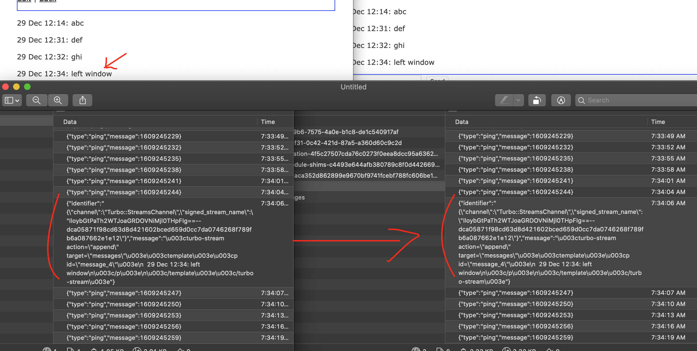
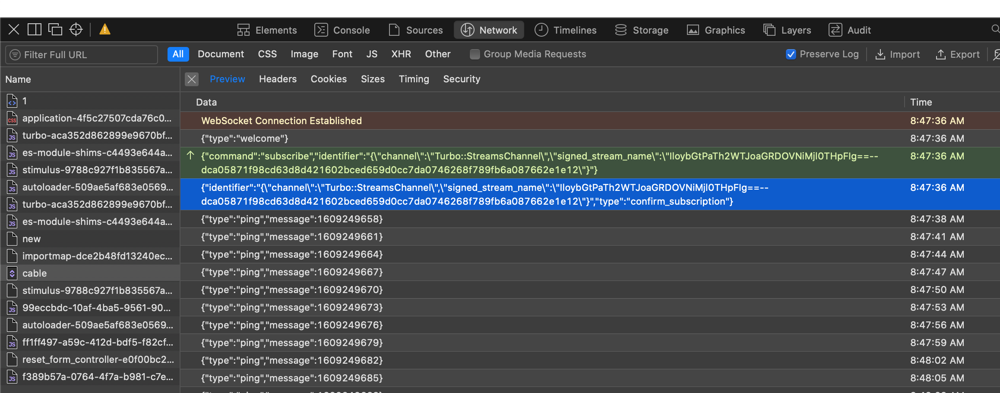

Convert Hotwire demo (https://hotwire.dev) to SpringBoot

Status : done through 6:40 of the demo video

Next Up: Web Sockets

PRs welcome.

-----
To run:
   
    $ mvn package
    $ java -jar target/hotwire-demo-chat-1.jar

The chat server creates an H2 database
chat-db.h2.mv.db (if it doesn't exist)
in the current working directory
and starts listening for HTTP requests
on http://localhost:8080/rooms.

-------
## Turbo Streams

From @4:40 in demo video:
> Turbo streams deliver:
>   * page changes
>   * over 
>     * web sockets or 
>     * in response to form submissions
>   * using
>     * just html and
>     * a set of crud-like action tags
> 
> The action tags let you:
>   * append,
>   * prepend to,
>   * replace, and
>   * remove
>   * any DOM element from the existing page, and
>   * are strictly limited to DOM changes (no JS).
> 
> If you can't do what you want with just DOM changes,
> then "connect a Stimulus controller."
> 

As of 4:40,
while you can 
add a new message 
to the chat room 
from a "framed" form
on the room detail page,
the new message is displayed
by a refresh of the room detail page.

As the number of messages in a room increases,
at some point posting a new message will
have a noticeable lag.

With a stream, 
adding a new message will
append to a DOM element,
which will not appear slower as
the message list size grows.


### Note: turbo-streams != web sockets

Two different things.  Turbo streams work fine with a standard
HTTP POST and response.

## Web Sockets

From @6:53 in demo video:
>
> First thing we'll do is establish a web socket
> connection to the stream identified by the room
> we're in.
> 
> This is done with a turbo stream from tag using
> a tamper-safe signed identifier of the view.
> 
>     <%= turbo_stream_from @room %>
> 
> [Showing browser developer tool pane.] 
> You can see the connection has been made to the
> turbo streams channel, running over Action Cable,
> from the inclusion of this tag.
> 

From https://turbo.hotwire.dev/handbook/streams:
>
> Turbo Streams deliver page changes as fragments of HTML 
> wrapped in self-executing <turbo-stream> elements.
>

* FORM POST = a pull of the self-executing element
* SOCKET    = a push of the self-executing element


### Rails demo socket traffic

Looking at the Rails hotwire demo
shows the following web socket markup
on the room detail page:

```
<turbo-cable-stream-source 
  channel="Turbo::StreamsChannel" 
  signed-stream-name="IloybGtPaTh2WTJoaGRDOVNiMjl0THpFIg==--dca05871f98cd63d8d421602bced659d0cc7da0746268f789fb6a087662e1e12"
  >
</turbo-cable-stream-source>
```


Inspecting traffic 
with two browser windows open
shows the socket network traffic:



It's a little hard to read in the image above, but if you squint 
you can see that the object 
that comes over the web socket
has the following structure:

* identifier
  * channel
  * signed_stream_name
* message

```
{ 
  "identifier": 
     "{\"channel\":\"Turbo::StreamsChannel\",\"signed_stream_name\":\"Iloy...1e12\"}",
  "message":
    "\u003cturbo-stream action=.../turbo-stream\u003e"
}
```

If we take the message attribute, 
make the following replacements
and add some whitespace,

    \u003c  -->  <
    \u003e  -->  >
    \"      -->  "
    \n      -->  new line

we get the same value the new message form POST returns:

```
<turbo-stream action="append" target="messages">
  <template>
    <p id="message_4">
      29 Dec 12:34: left window
    </p>
  </template>
</turbo-stream>
```

### MDN docs: Writing a WebSocket server in Java

From https://developer.mozilla.org/en-US/docs/Web/API/WebSockets_API/Writing_a_WebSocket_server_in_Java,
(paraphrased):
```
ServerSocket server = new ServerSocket(80);

System.out.println("server on 127.0.0.1:80 is waiting for a connection ...");
Socket client = server.accept();

System.out.println("a client connected.");

InputStream in = client.getInputStream();
OutputStream out = client.getOutputStream();

Scanner s = new Scanner(in, "UTF-8");

String data = s.useDelimiter("\\r\\n\\r\\n").next();
Matcher get = Pattern.compile("^GET").matcher(data);

String magic = "258EAFA5-E914-47DA-95CA-C5AB0DC85B11";
if (get.find()) {
    Matcher match = Pattern.compile("Sec-WebSocket-Key: (.*)").matcher(data);
    match.find();
    byte[] response = (
      "HTTP/1.1 101 Switching Protocols\r\n"
        + "Connection: Upgrade\r\n"
        + "Upgrade: websocket\r\n"
        + "Sec-WebSocket-Accept: "
        + Base64.getEncoder()
            .encodeToString(
              MessageDigest
                .getInstance("SHA-1")
                .digest((match.group(1) + magic).getBytes("UTF-8")))
        + "\r\n\r\n"
      ).getBytes("UTF-8");
    out.write(response, 0, response.length);
}
```

### Web socket traffic on page refresh



    {"type":"welcome"}

    {"command":
       "subscribe",
     "identifier":
       "{\"channel\":\"Turbo::StreamsChannel\",\"signed_stream_name\":\"IloybGtPaTh2WTJoaGRDOVNiMjl0THpFIg==--dca05871f98cd63d8d421602bced659d0cc7da0746268f789fb6a087662e1e12\"}"
    }

    {"identifier":
       "{\"channel\":\"Turbo::StreamsChannel\",\"signed_stream_name\":\"IloybGtPaTh2WTJoaGRDOVNiMjl0THpFIg==--dca05871f98cd63d8d421602bced659d0cc7da0746268f789fb6a087662e1e12\"}",
     "type":
       "confirm_subscription"
    }

### Spring docs

From https://docs.spring.io/spring-framework/docs/4.3.x/spring-framework-reference/html/websocket.html
>
> HTTP is used only for the initial handshake, 
> which relies on a mechanism 
> built into HTTP 
> to request a protocol upgrade 
> (or in this case a protocol switch) 
> to which the server can respond 
> with HTTP status 101 (switching protocols) 
> if it agrees. 
> 
> Assuming the handshake succeeds 
> the TCP socket underlying the HTTP upgrade request remains open 
> and both client and server 
> can use it to send messages 
> to each other.
>


